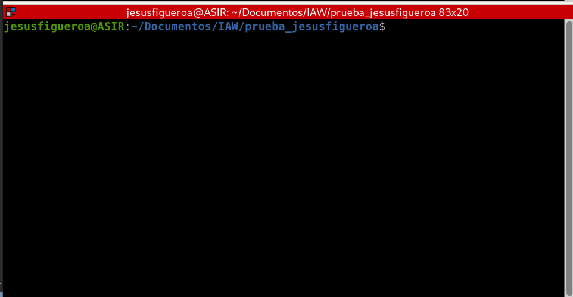

# prueba_jesusfigueroa
Repositorio de prueba 2ASIR

# Esto es el título principal

## Esto es un subtítulo

**Esto es negrita**
*Esto es cursiva*

```
Esto está escrito en código
```

```bash
sudo apt update (Código)
```
Lista ordenada

1. Infraestructura virtual
2. Servicios en red e Internet
3. Administración de bases de datos
4. Proyecto Integrado

Lista desordenada

- Infraestructura virtual
- Servicios en red e Internet
- Administración de bases de datos
- Proyecto Integrado

Enlace a URL externa

[Perfil de github](https://github.com/jfigueroaroldan0?tab=repositories)

Enlace a fichero .md

[Enlace a fichero](ficheromd_link.md)

Imagen



Tabla

| Aplicaciones web | Sistemas operativos | 
|------------------|---------------------|
| Práctica 1 Git   |Compilación paquetes |
| Práctica 2 Github|Compilación kernel   |
